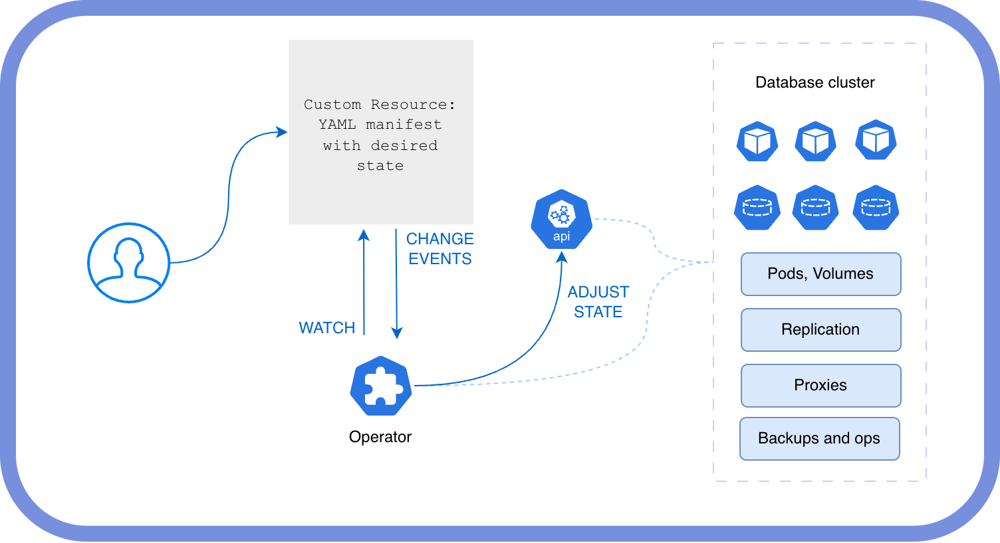
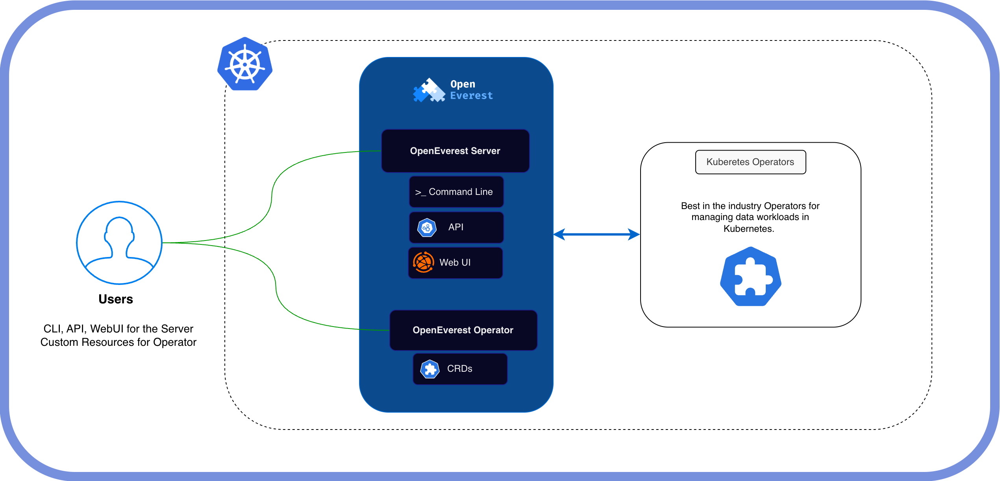

# Architecture

OpenEverest is an open-source platform for automated database provisioning and management on Kubernetes. This page explains the key architectural decisions behind OpenEverest and describes its main components.

## A small core, extended by Providers and Plugins

OpenEverest version 2 is built around a deliberately small core. Rather than baking every database technology and every feature directly into the platform, the core provides a consistent API, a web UI shell, and access control — and delegates everything technology-specific to two independently installed extension primitives:

- **Providers** teach OpenEverest how to manage a specific database or storage technology.
- **Generic Plugins** add new functionality beyond database provisioning.

Keeping the core small means new database engines and new capabilities can be added, upgraded, and released on their own cycles — without forking or rebuilding OpenEverest. Providers and Plugins are the heart of the v2 architecture; the core is the thin, stable surface they plug into.

→ [Extend OpenEverest](../extend/index.md) explains the extension model in depth.

## Kubernetes Operators

Providers build on a deliberate bet on **Kubernetes Operators** as the primary building block for deploying and managing stateful workloads.

A Kubernetes Operator is a software extension that uses custom resources to manage applications and their components. Operators encode operational knowledge — the same knowledge a human expert would use to deploy, configure, scale, and recover a specific piece of software.

### Why Operators?

Unlike Helm charts, which excel at initial deployment, Operators provide full day-2 operational capabilities out of the box:

- **Scaling** — horizontal and vertical, with proper coordination across cluster members
- **Backups and restores** — scheduled or on-demand, with point-in-time recovery
- **Maintenance** — rolling restarts, minor and major version upgrades
- **Self-healing** — automatic recovery from pod failures and configuration drift

Beyond automation, database Operators carry built-in domain expertise. They don't just start database pods in the right order — they also configure replication topologies, deploy read/write proxies and connection poolers, and tune engine-level settings based on the resources available. This expertise would otherwise require years of operational experience to develop in-house.

A Provider wraps one such Operator, exposing its capabilities through OpenEverest's consistent API.

## Main components

OpenEverest gives users a single pane of glass over their database fleet through a small core and the Providers and Plugins installed alongside it.

### OpenEverest core

The **OpenEverest core** is the control plane that users interact with directly. It stays intentionally thin and technology-agnostic, exposing:

- A **web UI shell** for managing instances, backups, monitoring, and access control. Providers and Plugins contribute the technology-specific screens.
- A **REST API** for programmatic access to all OpenEverest capabilities.

The core does not contain database-specific logic. Instead, it routes user intent — expressed as an `Instance` custom resource — to the Provider responsible for that technology, and loads UI and API extensions contributed by Plugins.

### Providers

A **Provider** is a self-contained plugin that teaches OpenEverest how to manage a specific database or storage technology. It reconciles the `Instance` custom resource by driving the underlying database Operator, defines the available components and deployment topologies, and ships the UI schema that generates the create and edit forms.

Providers are installed independently of the core and can be upgraded on their own release cycle. Adding a new database technology means installing a new Provider — no changes to the core are required.

→ [Learn about Providers](../extend/providers.md)

### Generic Plugins

A **Generic Plugin** extends OpenEverest with functionality beyond database provisioning. A plugin can contribute UI pages, sidebar entries, instance detail panels, backend API logic, and CLI subcommands — all without rebuilding or redeploying the core. Typical use cases include SQL query browsers, data migration tools, external database discovery, and compliance or audit tooling.

→ [Learn about Generic Plugins](../extend/generic-plugins.md)

Providers and Generic Plugins are discovered and installed through the [Extension Hub](../extend/hub.md).

