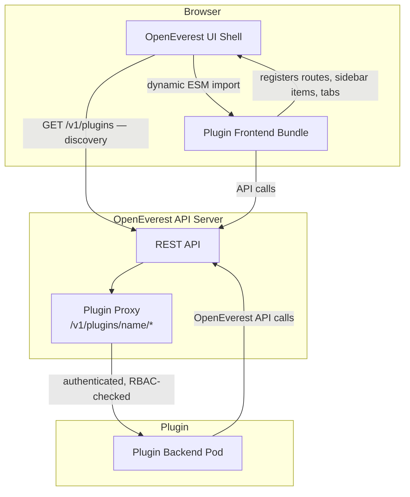

# Generic Plugins

Generic Plugins extend OpenEverest with new functionality beyond database provisioning. Where a [Provider](providers.md) teaches OpenEverest how to manage a database or storage technology, a Generic Plugin adds new capabilities on top of databases that already exist — without modifying or redeploying the OpenEverest core.

A plugin can contribute UI pages, sidebar entries, database detail panels, backend API logic, and `everestctl` subcommands. It is installed with Helm and appears in the OpenEverest interface immediately.

## What you can build

Generic Plugins cover a broad range of use cases:

| Example | Description |
|---------|-------------|
| **SQL query browser** | A DBeaver-like experience embedded directly in the OpenEverest UI. |
| **AI data copilot** | Introspects schemas, suggests queries, and answers questions about your data. |
| **External database discovery** | Imports visibility of databases managed outside the cluster (for example, AWS RDS instances). |
| **Data migration tool** | Moves data between clusters, providers, versions, or cloud regions. |
| **Compliance / audit plugin** | Enforces tagging policies, scans for exposed credentials, and generates audit reports. |
| **Custom metrics dashboard** | Pulls from Prometheus or another monitoring backend and renders a custom view. |

## Plugin anatomy

A plugin has up to three parts. The manifest is always required; the other two are present only when the plugin needs them.

```
plugin/
├── manifest.yaml   # Plugin CR — the single source of truth
├── main.js         # (optional) Frontend ESM bundle
└── server          # (optional) Backend binary / container image
```

### Manifest

The manifest is a `Plugin` Kubernetes custom resource. It declares the plugin's identity, which UI extension points it registers, the in-cluster or external backend service it exposes, and the OpenEverest API permissions it requires.

### Frontend bundle

An ESM JavaScript module that registers UI contributions (routes, sidebar entries, database detail tabs, dashboard widgets, and more) into the OpenEverest web UI shell at startup. The shell dynamically imports the bundle and renders the registered components at the declared extension points.

Plugin UI must use the host's MUI component library and theme, so plugin-contributed pages feel native to the OpenEverest interface.

### Backend pod

An optional HTTP service that implements custom logic on behalf of the plugin. All browser traffic to the backend is proxied through the OpenEverest API server — the browser never calls the backend directly. Requests are authenticated and RBAC-checked by the host before being forwarded.



## Installing a plugin

Plugins are distributed as Helm charts.

```bash
helm install <plugin-name> <chart-ref> --namespace everest-system
```

After installation, the plugin appears automatically in the OpenEverest UI without any additional configuration.

## Building your own plugin

The [generic-plugin-template](https://github.com/openeverest/generic-plugin-template) repository provides a working baseline plugin with skeleton code for both the frontend bundle and backend server, plus GitHub Actions workflows for building releases and Helm charts. It is the recommended starting point for any new plugin.

Detailed authoring documentation will be added in a future iteration. For now, the [plugin template repository](https://github.com/openeverest/generic-plugin-template) and [Spec 003](https://github.com/openeverest/specs/blob/main/specs/003-generic-plugins.md) are the primary references.
