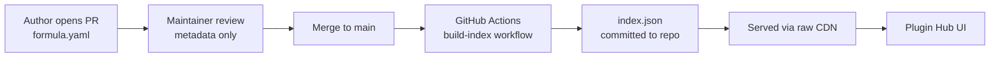

# Extension Hub

The Extension Hub is the central catalog for discovering and installing OpenEverest extensions — both [Providers](providers.md) and [Generic Plugins](generic-plugins.md). It gives the community a single, curated place to publish extensions and gives operators a single place to find and install them.

The Hub has two parts:

- **The catalog** — the [`openeverest/hub`](https://github.com/openeverest/hub) repository, a community-maintained registry of every published extension.
- **The Plugin Hub** — an in-product plugin that surfaces the catalog inside the OpenEverest UI and shows which extensions are already installed on your cluster.

## The catalog

The catalog lives in the [`openeverest/hub`](https://github.com/openeverest/hub) repository. It follows a formula / pointer model: each entry is a small `formula.yaml` file that points at an OCI artifact (a Helm chart) hosted in the author's own registry. The catalog stores metadata and a pointer — not the extension code itself.

Extensions are organized into two groups:

- **Providers** — database, storage and AI operators that OpenEverest manages.
- **Generic Plugins** — UI, CLI, and backend extensions of OpenEverest itself.

### How the index is generated

Authors contribute an extension by opening a pull request against the repository (see [Publishing an extension](#publishing-an-extension)). Because the formula is a pointer rather than code, review focuses on metadata accuracy and naming, not on a code audit.

When a pull request is merged into `main`, a GitHub Actions workflow regenerates an aggregated JSON manifest, `index/index.json`, and commits it back to the repository. This manifest contains the consolidated metadata for every plugin and provider in the catalog and is the single source of truth consumed by the Plugin Hub.

The index is published directly from `main` and served over the GitHub raw CDN:

```
https://raw.githubusercontent.com/openeverest/hub/main/index/index.json
```



## The Plugin Hub

The Plugin Hub is a Generic Plugin that renders the catalog inside the OpenEverest web UI. It is installed as a dependency of OpenEverest v2, so it is available out of the box.

At runtime, the Plugin Hub fetches the generated `index.json` from the catalog and joins it with the list of extensions currently installed on your cluster. The result is a searchable, filterable table of every published extension, annotated with its install status, default-channel version, and categories.

<!-- Screenshot placeholder: Plugin Hub extension browser in the OpenEverest UI -->

### Disabling the Plugin Hub

The Plugin Hub is enabled by default. If you do not want it, disable it at deploy time by setting the following Helm value when installing or upgrading the OpenEverest chart:

```yaml
plugins:
  hub:
    enabled: false
```

## Browsing and installing extensions

Each entry in the Plugin Hub opens a detail view with the extension's description, source repository, maturity, categories, and — for open extensions — installation instructions.

Installation is currently performed outside the UI using Helm with OCI artifacts. For each extension, the detail view shows a copy-pasteable `helm install` command that installs the latest version committed to the catalog. The command follows this shape:

```bash
helm install <release-name> \
  <oci-chart-ref> \
  --version <version> \
  --namespace everest-system
```

For example, installing the Plugin Hub itself manually:

```bash
helm install plugin-hub \
  oci://ghcr.io/openeverest/charts/plugin-hub \
  --version 0.1.13 \
  --namespace everest-system
```

Providers and plugins install into the `everest-system` namespace. After installation, the extension appears as installed in the Plugin Hub, and Providers become available when creating a database.

## Gated and vendor extensions

Not every extension is open source. Vendors can publish gated extensions — commercial or otherwise access-restricted — so that users can still discover them through the Hub.

Gated extensions are listed for discovery only. They typically do not include a public chart reference or an install command. Instead, the detail view shows the vendor, a short access note, and a link to the vendor's page where you can request a license, credentials, or more information.

For example, a commercial provider might expose only a contact link and licensing instructions rather than a `helm install` command. To use it, follow the vendor's process to obtain access and private registry credentials.

## Publishing an extension

To add your own Provider or Generic Plugin to the catalog:

1. Publish your extension as a Helm chart to an OCI-compatible registry (GHCR, Docker Hub, Quay, and so on).
2. Fork [`openeverest/hub`](https://github.com/openeverest/hub) and copy the `extensions/_template` directory into `extensions/providers/<slug>` or `extensions/plugins/<slug>`.
3. Fill in `formula.yaml`, add a `README.md` and a logo, and open a pull request against `main`.
4. Automated validation checks the schema, naming, and required files. A maintainer reviews the metadata, and on merge the index is regenerated automatically.

For the full field reference and step-by-step instructions, see the [publishing guide](https://github.com/openeverest/hub/blob/main/docs/PUBLISHING.md) in the catalog repository.

## Further reading

- [Extension Hub catalog](https://github.com/openeverest/hub) — the registry repository and `formula.yaml` schema.
- [Publishing guide](https://github.com/openeverest/hub/blob/main/docs/PUBLISHING.md) — how to add an extension.
- [Spec 007 — Extension Hub](https://github.com/openeverest/specs/blob/main/specs/007-extension-hub.md) — the full design.
- [Providers](providers.md) — database and storage extensions.
- [Generic Plugins](generic-plugins.md) — UI, CLI, and backend extensions.
