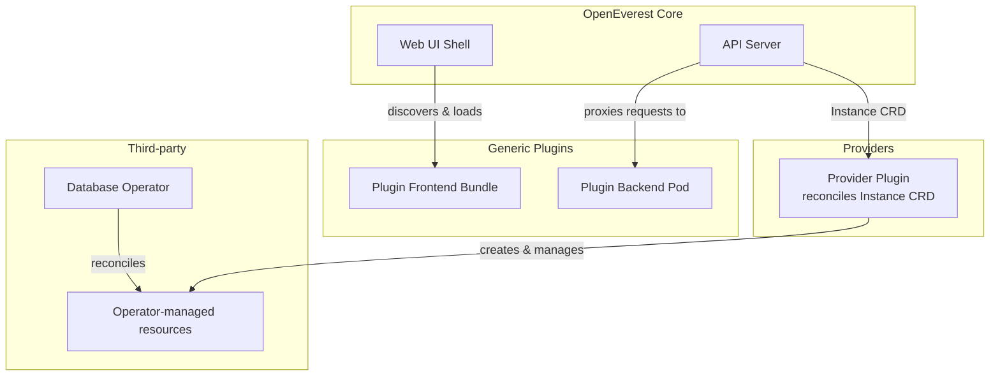

# Extend OpenEverest

OpenEverest v2 is built on a modular, extensible architecture. Rather than baking every database technology and feature directly into the core, v2 provides two complementary extension primitives that let developers, operators, and the community bring new capabilities to the platform — without forking or modifying the core.

This shift was a deliberate design goal: integrate a new database technology in days, not months.

## The two extension primitives

### Providers

A **Provider** is a self-contained plugin that teaches OpenEverest how to manage a specific databas or storage technology. It encapsulates the reconciliation logic for an operator, defines the available components and deployment topologies, and ships the UI schema that generates the create/edit forms in the OpenEverest interface.

Providers are installed independently of the OpenEverest core and can be upgraded on their own release cycle.

→ [Learn about Providers](providers.md)

### Generic Plugins

A **Generic Plugin** extends OpenEverest with new functionality beyond database provisioning. A plugin can contribute UI pages, sidebar entries, database detail panels, backend API logic, and CLI subcommands — all without rebuilding or redeploying the OpenEverest core.

Generic Plugins cover use cases like SQL query browsers, AI data copilots, external database discovery, data migration tools, and compliance/audit tooling.

→ [Learn about Generic Plugins](generic-plugins.md)

## Architecture overview

The diagram below shows how the two primitives relate to the OpenEverest core:

## Specifications and further reading

The full architectural specifications are maintained in the [openeverest/specs](https://github.com/openeverest/specs) repository:

- [Spec 001 — Modular core / Provider plugins](https://github.com/openeverest/specs/blob/main/specs/001-plugins-architecture.md)
- [Spec 003 — Generic plugins](https://github.com/openeverest/specs/blob/main/specs/003-generic-plugins.md)
