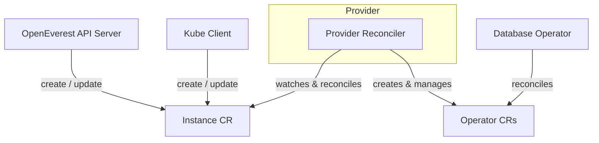

# Providers

A Provider is a self-contained plugin that adds a database or a storage technology to OpenEverest. It encapsulates everything the platform needs to provision, manage, and expose a database — the reconciliation logic for the underlying Kubernetes operator, the set of available components and topologies, and the UI schema that drives the create and edit forms.

Providers are decoupled from the OpenEverest core. They are installed and upgraded independently using standard Helm workflows, and a change to a Provider never requires a new release of the OpenEverest server or operator.

## How Providers work

OpenEverest manages databases through two custom resources: `Provider` and `Instance`.

### Provider CR

The `Provider` is a cluster-scoped custom resource that describes what a database technology offers:

- **Component types** — the building blocks of the database (for example, `mongod`, backup agent, monitoring sidecar), each with a list of available images and versions.
- **Version bundles** — named, curated sets of component versions known to be mutually compatible. An Instance references a bundle by name.
- **Topologies** — named deployment architectures (for example, `replicaset` or `sharded`). Each topology declares which components it includes and which are optional.
- **UI schema** — a declarative YAML definition that auto-generates the create and edit forms in the OpenEverest web UI.

### Instance CR

The `Instance` is a namespace-scoped custom resource that represents a running database. It references a Provider by name, selects a version bundle and topology, and holds the configuration for each component.

The Provider's reconciler watches Instance resources and translates them into the third-party operator's own custom resources (for example, a `PerconaServerMongoDB` CR). The underlying operator then does its normal reconciliation work.



### Schema-driven UI

Each Provider ships a YAML-based UI schema alongside its topology definitions. OpenEverest reads this schema at runtime to render the instance creation and edit forms — no frontend changes to the core are required when a new Provider is added or updated.

This also means a single Provider can surface multiple topologies natively. For example, the MongoDB Provider offers both `replicaset` and `sharded` topologies. The user selects a topology; the Provider handles the rest.

## Available Providers

A Provider Hub is planned for a future release, giving users a central place to discover and install community-contributed Providers.

### Percona Server for MongoDB Provider

The **Percona Server for MongoDB Provider** is the reference implementation for the v2 Provider model. It was chosen as the first provider because of its operational complexity — multiple component types, proxy and config server roles, backup agent, and sharded cluster support — which validates that the Provider architecture is robust enough for any database technology.

- Repository: [openeverest/provider-percona-server-mongodb](https://github.com/openeverest/provider-percona-server-mongodb)

**Install:**

```bash
helm install everest-mongodb openeverest/everest-provider-mongodb \
  --namespace everest-system
```

**Upgrade:**

```bash
helm upgrade everest-mongodb openeverest/everest-provider-mongodb \
  --namespace everest-system
```

## Building your own Provider

The [Provider SDK](https://github.com/openeverest/provider-sdk) is an open Go SDK designed to lower the barrier to building new Providers. It provides the reconciler scaffolding, lifecycle helpers, status utilities, and HTTP server for the validation webhook, so that provider authors focus on database-specific logic rather than Kubernetes plumbing.

The high-level steps are:

1. Scaffold a new provider using the SDK.
2. Define component types, version bundles, and topologies in the Provider CR definition.
3. Implement `Sync`, `Status`, `Validate`, and `Cleanup` on the `ProviderInterface`.
4. Write the UI schema YAML for each topology.
5. Build and publish a Helm chart for the provider.

Detailed authoring documentation will be added in a future iteration. For now, the [Provider SDK repository](https://github.com/openeverest/provider-sdk) and [Spec 001](https://github.com/openeverest/specs/blob/main/specs/001-plugins-architecture.md) are the primary references.
