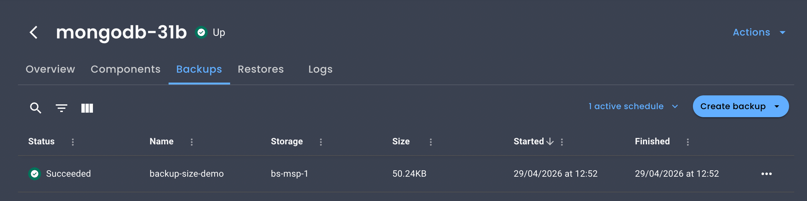

# What's new in OpenEverest 1.15.0

**New to OpenEverest?** Get started with our [Quickstart Guide](../quick-install.md).

---

## Release highlights

### ARM64 Architecture Support

All OpenEverest images are now published as multi-arch manifests to `ghcr.io`, covering both AMD64 and ARM64. No configuration changes are needed — if you run an ARM-based Kubernetes cluster, the right image is pulled automatically. This opens up deployment on AWS Graviton instances, Apple Silicon Macs for development, or — why not — a Raspberry Pi cluster at home.

### everestctl status Command

A new `everestctl status` command has been added for health checking Everest components. This provides a quick way to verify that all required operators and services are running correctly in your cluster.

```
$ everestctl status
❌ Everest v1.15.0 has issues

Components:
  NAME                NAMESPACE           STATUS       MESSAGE
  everest-server      everest-system      ❌ Not Ready  0/1 ready
  everest-operator    everest-system      ❌ Not Ready  0/1 ready
  catalog-operator    everest-olm         ❌ Not Ready  0/1 ready
  olm-operator        everest-olm         ❌ Not Ready  0/1 ready
  packageserver       everest-olm         ❌ Not Ready  0/2 ready
  vm-operator         everest-monitoring  ✅ Ready      
  kube-state-metrics  everest-monitoring  ✅ Ready      
```

### Backup Size Visibility in UI

The web UI now displays backup sizes for MongoDB clusters directly in the backup list view, making it easier to monitor storage usage and identify large backups at a glance.



### Percona Operator for PostgreSQL 2.9.0

OpenEverest now supports Percona Operator for PostgreSQL 2.9.0. Update your cluster to take advantage of the latest fixes and improvements in this operator release.

### Enhanced Security Posture

Container base images are now pinned by digest for reproducible builds, and OpenSSF Scorecard integration provides transparency into the project's security practices.

### Enhanced Helm Chart Flexibility

The Helm charts now support advanced Kubernetes scheduling with `nodeSelector`, `tolerations`, `affinity`, and `topologySpreadConstraints` for both server and operator components. You can also specify a custom `LoadBalancerClass` for the Everest server service.

---

## Changes

### Added

- [operator#942](https://github.com/openeverest/openeverest-operator/pull/942): Support for Percona Operator for PostgreSQL 2.9.0.
- [#1998](https://github.com/openeverest/openeverest/issues/1998), [#1921](https://github.com/openeverest/openeverest/issues/1921): ARM64 architecture support for all components.
- [#2010](https://github.com/openeverest/openeverest/issues/2010): `everestctl status` command for health checking Everest components.
- [#2044](https://github.com/openeverest/openeverest/issues/2044): Backup size display for MongoDB clusters in the web UI.
- [#2008](https://github.com/openeverest/openeverest/issues/2008): Added `storage` field to the `DatabaseCluster` proxy spec, enabling persistent volume configuration for ProxySQL.
- [helm-charts#11](https://github.com/openeverest/helm-charts/issues/11)Advanced scheduling controls (`nodeSelector`, `tolerations`, `affinity`, `topologySpreadConstraints`) for server and operator Helm chart deployments.
- [helm-charts#23](https://github.com/openeverest/helm-charts/issues/23): `LoadBalancerClass` support for the Everest server service in Helm charts.
- [helm-charts#27](https://github.com/openeverest/helm-charts/issues/27): Air-gapped upgrade support in Helm charts via a pre-built `everestctl` image, allowing upgrades in offline or internal network environments.
- [#2022](https://github.com/openeverest/openeverest/issues/2022): Artifact Hub badge for Helm chart discovery.
- [#2032](https://github.com/openeverest/openeverest/issues/2032): CLOMonitor badge for project health visibility.
- [#2013](https://github.com/openeverest/openeverest/issues/2013), [#2027](https://github.com/openeverest/openeverest/issues/2027): OpenSSF Scorecard badge and security tracking.
- [#1950](https://github.com/openeverest/openeverest/issues/1950): Sync guards for PSMDB and DB operator manifests.
- [#1951](https://github.com/openeverest/openeverest/issues/1951): GOVERNANCE.md pointing to the governance repository.
- [#2064](https://github.com/openeverest/openeverest/issues/2064): Added missing prerequisites to the dev setup guide.
- [#2056](https://github.com/openeverest/openeverest/issues/2056): Documented port 5000 conflict for k3d registry on macOS.
- [#1960](https://github.com/openeverest/openeverest/issues/1960): Added testing guidelines to CONTRIBUTING.md.
- [#1994](https://github.com/openeverest/openeverest/issues/1994): Added community meeting section to the documentation.
- [#1954](https://github.com/openeverest/openeverest/issues/1954): Added signing requirements to CONTRIBUTING.md.

### Changed & Improved

- [#2020](https://github.com/openeverest/openeverest/issues/2020): Updated to Go 1.26 and switched to Alpine-based container images.
- [#2041](https://github.com/openeverest/openeverest/issues/2041): Container base images pinned by digest for reproducible and auditable builds.
- [#1925](https://github.com/openeverest/openeverest/issues/1925): Added lazy loading for UI route pages, reducing the initial bundle size and improving page load times.
- [#1928](https://github.com/openeverest/openeverest/issues/1928): Optimized the Tilt development environment by caching DB operator manifests and Helm packages, removing redundant operator-init steps, and fixing image paths after the Helm chart move.
- [#1936](https://github.com/openeverest/openeverest/issues/1936), [#1952](https://github.com/openeverest/openeverest/issues/1952), [#1943](https://github.com/openeverest/openeverest/issues/1943): Automated copyright header management with `make copyright-headers` and `make copyright-check` commands, a `.copyrightignore` file, and a CI workflow that checks headers without modifying files.
- [#1950](https://github.com/openeverest/openeverest/issues/1950): Moved CODE_OF_CONDUCT.md to the repository root with a link to the governance repository.

### Fixed

- [operator#938](https://github.com/openeverest/openeverest-operator/issues/938): Fixed panic (`assignment to entry in nil map`) when creating a `DatabaseCluster` with `proxy.type: proxysql`. Also fixed a copy-paste error that caused ProxySQL resource requests to be read from HAProxy's spec.
- [#1953](https://github.com/openeverest/openeverest/issues/1953): Fixed worker node filtering to recognize the `node-role.kubernetes.io/control-plane` taint used in newer Kubernetes versions, in addition to the legacy `master` taint.
- [#1956](https://github.com/openeverest/openeverest/issues/1956): Fixed RBAC model import path that broke under Vite 5+ in dev mode by moving the file out of the `public` directory.
- [#2062](https://github.com/openeverest/openeverest/issues/2062): Fixed incorrect `singular` field name in the Storage CRD (`storages` to `storage`).
- [#1917](https://github.com/openeverest/openeverest/issues/1917): Fixed button not fitting screen in the UI.
- [#1996](https://github.com/openeverest/openeverest/issues/1996): Fixed API integration tests CI.
- [#1921](https://github.com/openeverest/openeverest/issues/1921): Fixed Everest exposure in dev environment with and without Tilt.
- [#2066](https://github.com/openeverest/openeverest/issues/2066): Fixed Homebrew tap dispatch workflow.
- [#1924](https://github.com/openeverest/openeverest/issues/1924): Fixed build failure when `index.html` doesn't exist.
- [#1921](https://github.com/openeverest/openeverest/issues/1921): Fixed CI after Helm chart move.

---

## Upgrade to OpenEverest 1.15.0

### Using everestctl

```sh
everestctl upgrade
```

### Using Helm directly

```sh
helm repo update openeverest
helm upgrade everest openeverest/everest -n everest-system
```

---

**Full Changelog**: https://github.com/openeverest/openeverest/compare/v1.14.0-rc1...v1.15.0
