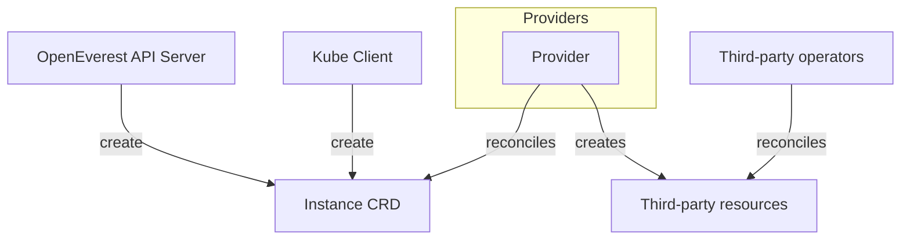
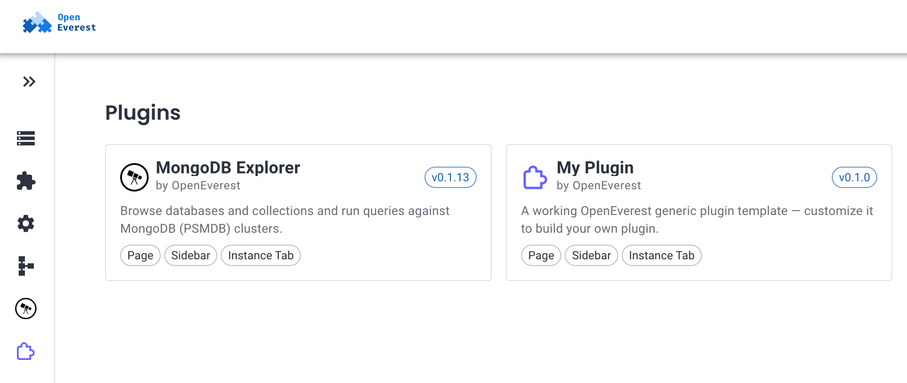
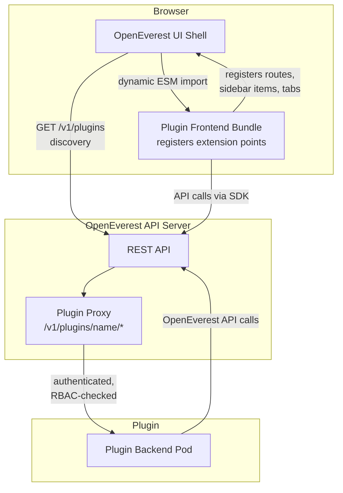

# What's new in OpenEverest 2.0.0 Developer Preview 1

!!! warning "Developer Preview — not for production"
    OpenEverest 2.0.0 Developer Preview 1 is an early-look release and is **not feature-complete**. It is intended for testing and feedback only. Breaking changes — including API updates — are expected as we move toward General Availability.

    There is **no supported upgrade path from v1**. The two versions have fundamentally different architectures and data models. Running v1 and v2 side-by-side in the same cluster is not supported.

**New to OpenEverest?** Get started with our [Quickstart Guide](../quick-install.md).

---

## Release highlights

### From Monolith to Modular: The v2 Architecture

OpenEverest 2.0 marks a shift in how the platform is built and extended. The monolithic architecture of v1 — where database-specific logic was baked into the core server, operator, CLI, and UI — has been replaced with a modular system built around two key extensibility primitives: **Providers** and **Generic Plugins**.

This change means that integrating a new database technology no longer requires touching the OpenEverest core. It can be done in days, not months, by any developer using the published SDKs.

---

### Provider SDK

The [Provider SDK](https://github.com/openeverest/provider-sdk) is the cornerstone of v2 modularity. A Provider is a self-contained plugin that encapsulates all the logic for a specific database technology — its components, topologies, reconciliation logic, and the UI schema used to render creation and edit forms.



Key benefits of the Provider model:

- **Independent release cycles.** A Provider can be updated without releasing a new version of the OpenEverest server or operator.
- **Rapid feature parity.** When an upstream operator adds a feature, it can be surfaced in OpenEverest by updating only the Provider plugin.
- **Multi-topology support.** A single Provider can offer multiple deployment architectures natively (for example, MongoDB replica set vs. sharded cluster). Users select a topology; the Provider handles the rest.

Providers are installed and managed with standard Helm workflows.

#### MongoDB Provider — first reference implementation

OpenEverest 2.0 ships with a single [provider for MongoDB](https://github.com/openeverest/plugin-mongodb-explorer). MongoDB was intentionally chosen as the first provider because of its operational complexity — numerous moving parts, proxy components, and backup agents. Successfully modularizing MongoDB validates that the Provider architecture is robust enough for any database technology.

#### Building your own Provider

The basic steps to create a new Provider plugin:

1. Scaffold your provider using the Go-based [Provider SDK](https://github.com/openeverest/provider-sdk).
2. Define components and topologies — components represent features such as engine, proxy, and backup agent; a topology groups a set of components.
3. Implement your operator reconciliation logic in the provider.
4. Write a UI schema that auto-generates the OpenEverest creation and edit forms.
5. Run your provider locally for quick testing or install it via the generated Helm chart.


Detailed instruction on how to create a new Provider plugin is [here](https://github.com/openeverest/provider-sdk/blob/main/PROVIDER_DEVELOPMENT.md).
---

### Generic Plugins

Generic Plugins extend OpenEverest beyond database provisioning. Any developer can create a plugin that adds new UI surfaces and backend functionality to an existing OpenEverest installation — without forking or modifying the core.

Example use cases:

- A **SQL query browser** (DBeaver-like experience) embedded in the OpenEverest UI.
- An **AI data copilot** that introspects schemas, suggests queries, and answers questions about your data.
- An **AWS RDS discovery** plugin that imports visibility of databases managed outside the cluster.
- A **data migration tool** for moving data between clusters, providers, versions, or cloud regions.
- A **compliance/audit plugin** that enforces tagging policies and scans for exposed credentials.



A plugin consists of two parts:

- **Backend** — a Pod that exposes an API embedded into the OpenEverest API endpoints.
- **Frontend** — a JavaScript bundle that registers extension points (routes, sidebar items, tabs) in the OpenEverest UI shell.



Plugins are installed with Helm and appear in the UI immediately after installation.

To get started, use the [generic-plugin-template](https://github.com/openeverest/generic-plugin-template) repository, which includes a working baseline plugin, skeleton code, and GitHub Actions workflows for building releases and Helm charts. The full Generic Plugins specification is available in the [specs repository](https://github.com/openeverest/specs/blob/main/specs/003-generic-plugins.md).

---

### Schema-driven UI

The OpenEverest UI is no longer hardcoded per database type. Each Provider ships a schema that auto-generates the instance creation and edit forms. This enables:

- **1-click deployments** using sensible defaults for users who just want a running database.
- **Full granular control** for power users who need to fine-tune every configuration parameter.

As new providers are added, their UI surfaces appear automatically — no frontend changes to OpenEverest core are required.

---

## Installing OpenEverest 2.0.0 Developer Preview 1

OpenEverest v2 is installed via Helm. You will need a running Kubernetes cluster and `helm` installed.

Install the OpenEverest core:

```bash
helm repo add openeverest https://openeverest.github.io/helm-charts/
helm repo update
helm install everest-core openeverest/openeverest \
  --devel \
  --version "2.0.0-dev.1" \
  --namespace everest-system \
  --create-namespace
```

Once the core is up, install the MongoDB provider:

```bash
helm repo add provider-percona-server-mongodb https://openeverest.github.io/provider-percona-server-mongodb/
helm repo update
helm install provider-percona-server-mongodb provider-percona-server-mongodb/provider-percona-server-mongodb \
  --namespace everest-system
```

---

## v1 Support and End-of-Life Timeline

OpenEverest v1 continues to be supported while v2 matures. The transition timeline is as follows:

| Stage | Description |
|-------|-------------|
| **Now** | v2 Developer Preview — testing and feedback. |
| **v2 General Availability** | Expected in a few months. |
| **GA + 3 Months** | v1 enters Maintenance Mode. Security patches and critical bug fixes only; no new features. |
| **GA + 12 Months** | v1 reaches End of Life. No further releases. |

---

## Get involved

Try the Developer Preview, test the MongoDB Provider, and share your feedback. The project is open to contributions — provider plugins, generic plugins, and core improvements are all welcome.

- [Provider SDK](https://github.com/openeverest/provider-sdk)
- [Generic Plugin Template](https://github.com/openeverest/generic-plugin-template)
- [Generic Plugins Spec](https://github.com/openeverest/specs/blob/main/specs/003-generic-plugins.md)
